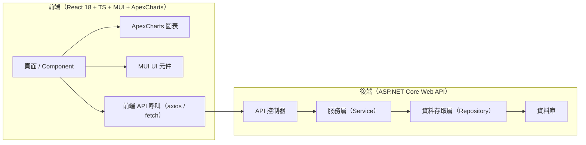
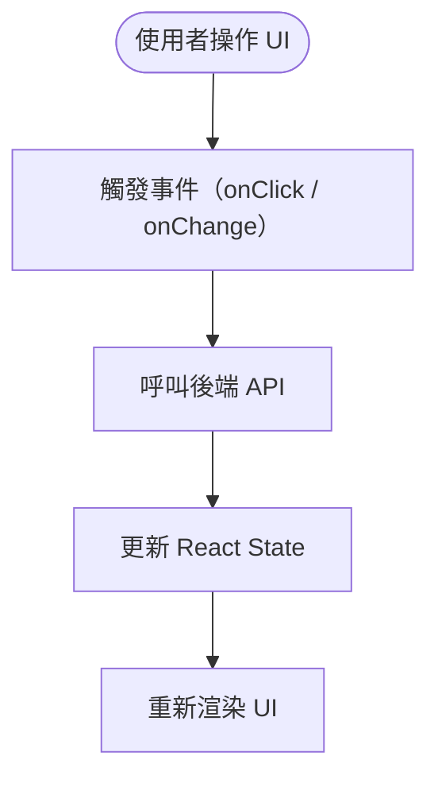
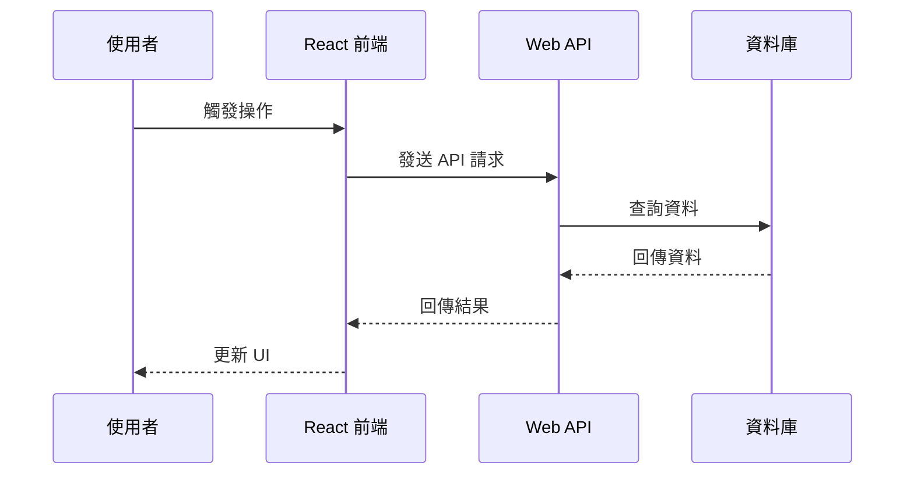

---

# ✅ **instructions.md（最終整合 + 前後端技術棧版）**

```markdown
# 專案 AI Agent 進階行為規範（instructions.md）
本檔適用於 Visual Studio 2022、多專案大型解決方案，並包含前端 React 18 + MUI + TypeScript + ApexCharts 與後端 Web API 的完整技術棧資訊。  
所有回覆、紀錄、圖表標註均需使用繁體中文。

---

# 1. 啟動行為：多專案掃描與架構索引

## 1.1 專案技術棧（固定，不得猜測）
本專案採用以下技術棧，Agent 在啟動時不得自行推測或假設其他框架：

### 前端（Frontend）
- **React 18**
- **TypeScript**
- **MUI（Material UI）**
- **ApexCharts**
- **Vite 或 CRA（若偵測到）**
- 前端程式碼位置：`/frontend` 或偵測到含 `package.json` 且含 React 依賴的資料夾

### 後端（Backend）
- **ASP.NET Core Web API**
- C# / .NET 6+（依專案實際版本）
- 後端程式碼位置：含 `.sln`、`.csproj` 的資料夾

Agent 必須依此技術棧進行分析，不得猜測使用 Vue、Angular、Next.js、Node.js、PHP、Java Spring 等不存在的技術。

---

## 1.2 啟動掃描範圍
Agent 啟動時必須執行：

### 後端掃描
- 掃描所有 `.sln`、`.csproj`、`.fsproj`、`.vbproj`
- 辨識 Web API 專案（含 `Program.cs`、`Startup.cs`、Controllers 資料夾）

### 前端掃描
- 掃描含 `package.json` 的資料夾
- 確認是否包含：
  - `"react": "^18.x"`
  - `"@mui/material"`
  - `"typescript"`
  - `"apexcharts"` 或 `"react-apexcharts"`

### 禁止事項
- ❌ 不得推測前端框架  
- ❌ 不得推測後端語言  
- ❌ 不得推測資料庫種類（除非專案中明確出現）

---

## 1.3 架構分析與索引內容

### 後端索引
- 專案結構（Controllers、Services、Repositories、Models）
- API 路由與端點
- DI（依賴注入）架構
- 呼叫鏈（Controller → Service → Repository）
- 外部 API 呼叫
- 資料庫存取（若存在）

### 前端索引
- React Component 結構（Functional Components）
- Hooks 使用情況（useState、useEffect、useMemo…）
- MUI UI 架構（Theme、Components）
- ApexCharts 圖表使用位置
- API 呼叫邏輯（axios / fetch）
- Routing（React Router）
- State 管理（若有 Redux、Zustand、Recoil 等）

### 全域架構索引
- 前後端 API 互動流程
- 前端頁面與後端 API 的對應關係
- 前端資料流（UI → API → UI）

所有索引描述需使用繁體中文。

---

# 2. 安全檢查規範

## 後端安全檢查
- 輸入驗證（避免未驗證資料進入 DB）
- 授權與角色控制
- 避免回傳敏感例外訊息
- 避免硬編碼金鑰、密碼、連線字串
- 日誌不得記錄敏感資訊

## 前端安全檢查
- API 回應錯誤處理
- 避免在前端暴露敏感資訊
- 避免將 Token 存在 localStorage（若專案使用需提出風險）
- 圖表資料需避免洩漏敏感資訊

---

# 3. 命名規範（Naming Conventions）

## 後端（C#）
- 類別：PascalCase（UserService）
- 介面：I 前綴（IUserService）
- 方法：PascalCase（GetUserById）
- 參數：camelCase（userId）
- 非同步方法：Async 結尾（GetUserAsync）

## 前端（React + TypeScript）
- Component：PascalCase（UserCard.tsx）
- Hooks：camelCase（useUserData）
- 變數：camelCase（userList）
- 型別 / Interface：PascalCase（UserDto）
- MUI Styled Component：PascalCase（StyledButton）
- ApexCharts Options：camelCase（chartOptions）

---

# 4. 任務處理流程（含前後端）

## 4.1 任務接收與範圍界定
Agent 必須明確定義：

- 是否為前端任務 / 後端任務 / 全端任務
- 涉及的檔案（React Component、API Controller…）
- 涉及的資料流（UI → API → DB）

## 4.2 修改計畫（Modification Plan）
需包含：

- 任務目標
- 修改檔案與專案
- 修改步驟
- 安全考量（若有）
- 前後端影響分析

未獲得使用者確認前不得修改程式碼。

---

# 5. 程式碼修改規範

- 僅能修改已確認的範圍
- 保持前端與後端各自的程式風格一致
- 若遇到不確定邏輯需詢問使用者
- 若需重構需說明目的與風險

---

# 6. 修改紀錄規範（modify.log.md）

每次修改後必須寫入：

- 修改時間
- 任務描述
- 所屬 Solution / Project（前端或後端）
- 修改範圍
- 異動檔案
- 主要邏輯變更摘要
- 安全相關變更（若有）
- 可能影響的模組或功能

---

# 7. 自動產生架構圖與流程圖規範

Agent 必須能產生：

- 系統架構圖（前端 + 後端）
- 前端 UI 流程圖
- 後端 API 呼叫流程圖
- 前後端整合時序圖

## 7.1 產圖前必須提供
- 圖表用途
- 涉及的前端 Component / 後端 API
- 圖表類型
- 是否需分段

## 7.2 產圖後必須提供
- 圖表摘要
- 每個節點的意義
- 外部系統資料流與風險

---

# 8. Mermaid / PlantUML 圖表統一範本

（以下為固定格式，Agent 必須依此產圖）

## 8.1 前後端整體架構圖（Mermaid）


## 8.2 前端流程圖（Mermaid）


## 8.3 前後端時序圖（Mermaid）


（PlantUML 版本略，同樣包含前端與後端）

---

# 9. 回覆與互動規範

- 所有回覆、說明、註解、紀錄一律使用繁體中文
- 回覆需清楚、結構化
- 程式碼需附中文說明
- 建議需附理由與可能影響

---

# 10. 禁止事項

- 未經確認不得修改程式碼
- 不得刪除檔案（除非使用者明確要求）
- 不得推測不存在的技術棧
- 不得使用英文作為主要語言
- 不得隱藏安全風險

---

# 11. 目標

本 instructions.md 旨在：

- 讓 Agent 在前後端多專案環境中以可控、可預期方式運作
- 確保所有修改具備透明度、可追蹤性、安全性
- 透過架構分析與圖表協助理解與維護系統
```