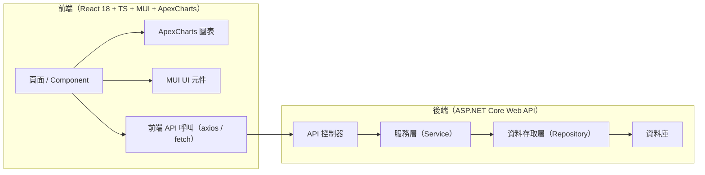
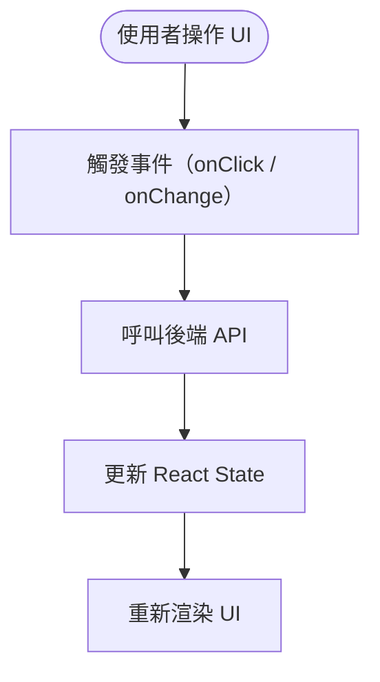
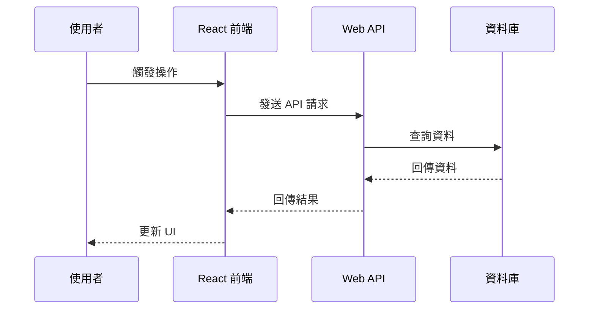

---

```markdown
# 專案 AI Agent 進階行為規範（最終整合版 instructions.md）
本檔為本專案 AI Agent 的完整行為規範，包含：
- 啟動行為（掃描、索引、產生 structure.md）
- 任務處理流程（需先讀取 structure.md）
- 前端 React 18 + MUI + TypeScript + ApexCharts 支援
- 後端 ASP.NET Core Web API 支援
- 安全規範、命名規範、修改規範
- Mermaid / PlantUML 圖表產生規範
- structure.md 標準格式
- modify.log.md 標準格式

所有回覆、紀錄、圖表標註均需使用繁體中文。

---

# 1. 專案技術棧（固定，不得猜測）

## 1.1 前端（Frontend）
- React 18
- TypeScript
- MUI（Material UI）
- ApexCharts
- React Router（若存在）
- axios / fetch（API 呼叫）
- 前端程式碼位置：含 `package.json` 且包含 React 依賴的資料夾

## 1.2 後端（Backend）
- ASP.NET Core Web API
- C# / .NET 6+
- DI（依賴注入）
- EF Core / Dapper（若存在）
- 後端程式碼位置：含 `.sln`、`.csproj` 的資料夾

Agent 不得推測不存在的技術（例如 Vue、Angular、Node.js、Java Spring 等）。

---

# 2. 啟動行為：掃描、索引、產生 structure.md

## 2.1 啟動掃描範圍

### 後端掃描
- 掃描所有 `.sln`、`.csproj`、`.fsproj`、`.vbproj`
- 辨識 Web API 專案（含 `Program.cs`、`Startup.cs`、Controllers）

### 前端掃描
- 掃描含 `package.json` 的資料夾
- 確認是否包含：
  - `"react": "^18"`
  - `"@mui/material"`
  - `"typescript"`
  - `"apexcharts"` 或 `"react-apexcharts"`

---

## 2.2 架構索引內容（前端 + 後端）

### 後端索引
- Controllers / Services / Repositories / Models
- API 路由與端點
- DI（依賴注入）
- 呼叫鏈（Controller → Service → Repository）
- 外部 API 呼叫
- 資料庫存取（若存在）

### 前端索引
- React Component Tree
- Hooks 使用情況（useState、useEffect、useMemo…）
- MUI UI 架構（Theme、Components）
- ApexCharts 使用位置
- API 呼叫邏輯（axios / fetch）
- Routing（React Router）
- State 管理（若存在 Redux、Zustand 等）

### 全域架構索引
- 前後端 API 互動流程
- 前端頁面與後端 API 的對應關係
- 前端資料流（UI → API → UI）

---

## 2.3 structure.md 自動產生規則（Auto-Generation Rules）

### 產生時機
- 每次 Agent 啟動時必須重新產生 `structure.md`
- 若偵測到專案結構變更，需重新產生
- 不得沿用舊資料，不得推測不存在的架構

### 產生內容來源
- 前端與後端實際程式碼掃描結果
- API 對應關係
- 資料流與流程
- 安全熱點

### 產生格式
- 必須完全遵守「structure.md 標準格式」
- 所有段落、標題、欄位均不得省略或更動
- 所有內容必須使用繁體中文

### 產生後使用規則
- `structure.md` 是後續所有任務分析的唯一架構依據
- Agent 在接到任務後，必須先讀取 `structure.md`
- 未讀取 `structure.md` 不得制定修改計畫

---

# 3. 任務處理流程（需讀取 structure.md）

## 3.1 任務接收與範圍界定
Agent 必須依序執行：

1. **讀取最新的 structure.md**
2. 依據 structure.md 分析任務
3. 明確定義修改範圍（前端 / 後端 / 全端）
4. 標示跨專案影響

---

## 3.2 制定修改計畫（Modification Plan）
修改前必須提出：

- 任務目標
- 修改檔案與專案
- 修改步驟
- 安全考量（若有）
- 前後端影響分析
- 依據 structure.md 的依賴關係說明修改理由

未獲得使用者確認前不得修改任何程式碼。

---

# 4. 程式碼修改規範

- 僅能修改已確認的範圍
- 保持前端與後端各自的程式風格一致
- 若遇到不確定邏輯需詢問使用者
- 若需重構需說明目的與風險
- 修改後需更新 `modify.log.md`

---

# 5. 安全規範

## 前端安全
- Token 儲存位置
- API 錯誤處理
- 避免暴露敏感資訊

## 後端安全
- 授權 / 驗證邏輯
- 外部 API 呼叫
- 資料庫連線字串
- 例外處理與日誌

---

# 6. 命名規範（Naming Conventions）

## 後端（C#）
- 類別：PascalCase
- 介面：I 前綴
- 方法：PascalCase
- 參數：camelCase
- 非同步方法：Async 結尾

## 前端（React + TS）
- Component：PascalCase
- Hooks：camelCase（useXxx）
- 變數：camelCase
- 型別 / Interface：PascalCase
- MUI Styled Component：PascalCase
- ApexCharts Options：camelCase

---

# 7. Mermaid / PlantUML 圖表產生規範

## 7.1 前後端整體架構圖（Mermaid）


## 7.2 前端流程圖（Mermaid）


## 7.3 前後端時序圖（Mermaid）


---

# 8. structure.md 標準格式（Agent 產生時必須遵守）

（以下為固定格式）

```
# 專案架構索引（structure.md）
本檔由 AI Agent 自動產生，內容包含前端與後端的完整架構索引、資料流、流程摘要與安全熱點。

# 1. 專案總覽
（前端技術棧、後端技術棧、整體架構摘要）

# 2. 專案資料夾與檔案結構
（前端樹狀結構、後端樹狀結構）

# 3. 前端架構索引
（Component Tree、Hooks、MUI、ApexCharts、API 呼叫）

# 4. 後端架構索引
（Controllers、Services、Repositories、Models、呼叫鏈）

# 5. 前後端資料流
（UI → API → DB、API 回應 → UI）

# 6. 重要程式流程摘要
（登入流程、查詢流程、圖表資料流程…）

# 7. 安全熱點
（前端、後端）

# 8. 系統架構圖
（Mermaid / PlantUML）

# 9. 前後端時序圖
（Mermaid / PlantUML）

# 10. 版本資訊
（產生時間、由 AI Agent 自動產生）
```

---

# 9. modify.log.md 標準格式（Agent 修改後必須遵守）

```
## [YYYY-MM-DD HH:mm:ss] 修改紀錄

### 任務描述
（使用者提出的任務內容摘要）

### 所屬解決方案 / 專案
- 前端：/frontend（或實際路徑）
- 後端：/backend（或實際路徑）

### 修改範圍
（依照 structure.md 的架構，列出受影響的模組、類別、檔案）

### 異動檔案
- 相對路徑 1
- 相對路徑 2

### 主要邏輯變更摘要
（前端 Component / Hook / State 變更、後端 Controller / Service / Repository 變更）

### 安全相關變更（若有）
（授權、驗證、例外處理、敏感資訊處理）

### 可能影響
（前端 UI、後端 API、資料流、其他模組）

### 版本資訊
- 由 AI Agent 自動產生
```

---

# 10. 禁止事項

- 未經確認不得修改程式碼
- 不得刪除檔案（除非使用者明確要求）
- 不得推測不存在的技術棧
- 不得使用英文作為主要語言
- 不得隱藏安全風險
- 未讀取 structure.md 不得制定修改計畫

---

# 11. 目標

本 instructions.md 旨在：

- 讓 Agent 在前後端多專案環境中以可控、可預期方式運作
- 確保所有修改具備透明度、可追蹤性、安全性
- 透過 structure.md、架構分析與圖表協助理解與維護系統
```

---